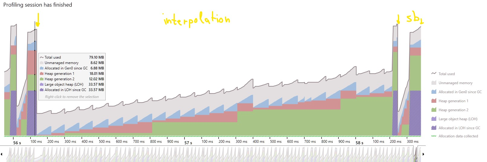

# .NET Performance tests

.NET Core 3.1 Console application, Release build

### Time ###

|Method name|ms|%|
|-|-:|-:|
|StringInterpolation|10 813 ms|9.53%|
|StringBuilderAppend|5 427 ms|4.78%|
### Memory ###

